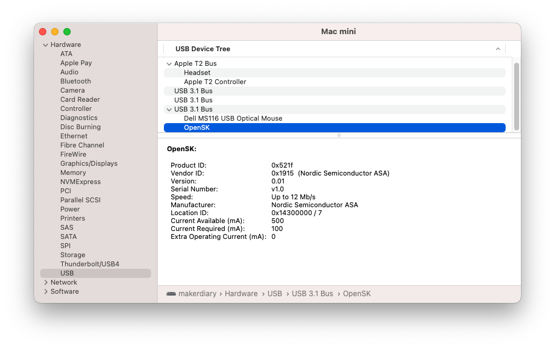
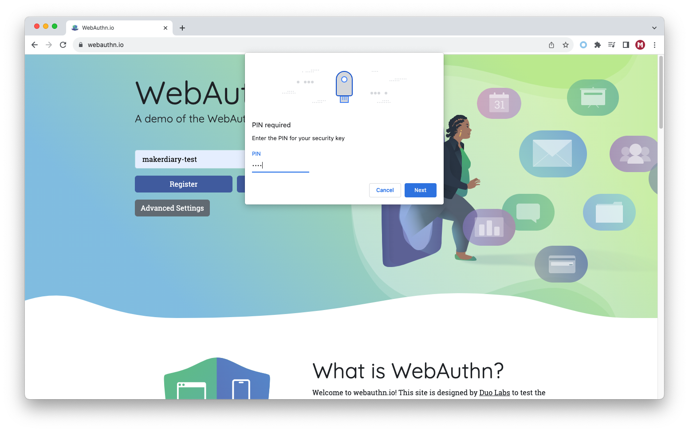

# Getting started with OpenSK

## Introduction

This tutorial provides a quick introduction to making your own OpenSK FIDO2 authenticator with nRF52840 MDK USB Dongle.

## Requirements

Before you start, check that you have the required hardware and software:

* 1x [nRF52840 MDK USB Dongle](https://makerdiary.com/products/nrf52840-mdk-usb-dongle)(or [w/Case](https://makerdiary.com/products/nrf52840-mdk-usb-dongle-w-case) option)
* Latest version of Google Chrome, Mozilla Firefox, Microsoft Edge or Apple Safari

## Programming the latest OpenSK firmware

Download the [latest firmware](https://github.com/makerdiary/OpenSK-firmware/releases) and complete the following steps to program the firmware:

1. Push and hold the button and plug your dongle into the USB port of your computer. Release the button after your dongle is connected. The RGB LED turns green.
2. It will mount as a Mass Storage Device called __UF2BOOT__.
3. Drag and drop `opensk-nrf52840_mdk_usb_dongle-<version>.uf2` onto the __UF2BOOT__ volume. The RGB LED blinks red fast during flashing.
4. Re-plug the dongle and the OpenSK device will start running.

!!! Note "About the Volume Label"
    The dongle manufactured after July 20 2023 is shipped with the latest [UF2 Bootloader 0.7.1](https://github.com/makerdiary/nrf52840-mdk-usb-dongle/tree/main/firmware/uf2_bootloader), which will mount as a Mass Storage Device called __UF2BOOT__. If you are running the older bootloader, it will mount as __MDK-DONGLE__.

## Testing OpenSK

After flashing the firmware to your dongle, complete the following steps to test it:

1. Visit https://webauthn.io/ in a supported web browser, for example, Google Chrome.
2. Enter an example username and then click __Register__. You will be prompted to choose the way to create a passkey. Select __USB security key__.

    

3. Plug the dongle into the USB port of your computer. __Red LED__ and __Blue LED__ are blinking, which asks you to confirm the transaction with a button press.
4. After the button is pressed, you will be prompted to enter a PIN for your security key. Just enter your PIN and click __Next__.

    

5. __Red LED__ and __Blue LED__ are blinking again and press the button again to complete the request. Then you will see the success notification.

    

6. Now try to authenticate by click __Authenticate__. You will be prompted to enter the PIN you set above. Just enter your PIN and click __Next__.

    

7. __Red LED__ and __Blue LED__ are blinking and you are asked to confirm the request with a button press. Press the button and you will be logged in.

    

## Explore More

The two-factor authentication (2FA) has been successfully deployed by a growing number of websites and platforms, including Google, social networks, cloud providers, and many others. Happy trying!